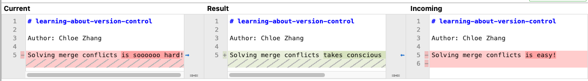

# learning-about-version-control

Author: Chloe Zhang

Solving merge conflicts takes conscious effort, but I can do it!

I love version control because it keeps copies of work history.
I am frustrated about version control are the numerous different git commands.

Dear TA,

Hi! I wasn't sure canvas uploaded the screenshot successfully, so I just insert a copy here.
Sorry for the inconvenience.

